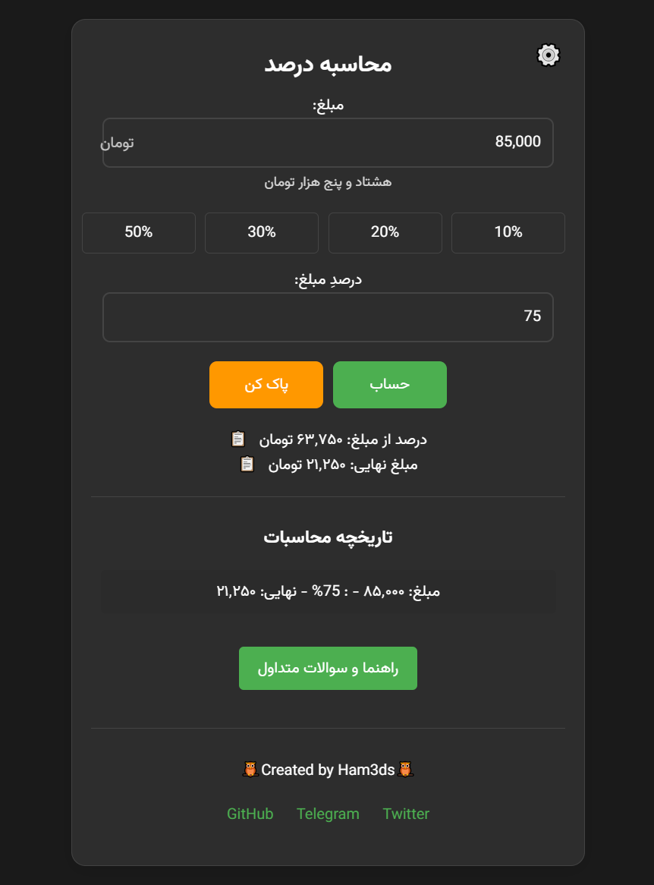

# محاسبه درصد - Dar100

## توضیحات

این برنامه یک ماشین حساب ساده و کاربردی برای محاسبه درصد از مبلغ است. می‌توانید به راحتی مبلغ مورد نظر و درصد آن را وارد کنید تا مبلغ نهایی پس از اعمال درصد (مانند تخفیف یا مالیات) را مشاهده کنید.  این برنامه دارای ویژگی‌هایی مانند تاریخچه محاسبات، تبدیل عدد به حروف، حالت شب/روز و تنظیمات دیگر است.

## ویژگی‌ها

*   محاسبه سریع و آسان درصد از مبلغ
*   نمایش مبلغ به حروف
*   تاریخچه محاسبات (تا ۵ محاسبه اخیر)
*   قابلیت کپی نتیجه
*   حالت شب/روز (Dark/Light Mode)
*   دکمه‌های میانبر برای درصدهای رایج (10%、20%、30%、50%)
*   بخش راهنما و سوالات متداول
*   ذخیره خودکار محاسبات (قابل تنظیم)
*   تبدیل اعداد به حروف فارسی

## دموی آنلاین

[https://dar100.netlify.app](https://dar100.netlify.app)

## نحوه استفاده

1.  مبلغ مورد نظر را در فیلد "مبلغ" وارد کنید.
2.  درصد مورد نظر را در فیلد "درصد مبلغ" وارد کنید یا از دکمه‌های میانبر استفاده کنید.
3.  روی دکمه "حساب" کلیک کنید.
4.  نتیجه در بخش "نتیجه" نمایش داده می‌شود.

## کلیدهای میانبر

*   `Ctrl + Enter`: محاسبه
*   `Esc`: پاک کردن فرم
*   `Alt + 1`: 10%
*   `Alt + 2`: 20%
*   `Alt + 3`: 30%
*   `Alt + 5`: 50%

## تنظیمات

با کلیک بر روی آیکون چرخ‌دنده در بالای صفحه، می‌توانید به بخش تنظیمات دسترسی داشته باشید. در این بخش می‌توانید حالت شب/روز، ذخیره خودکار و موارد دیگر را تنظیم کنید.

## راهنما و سوالات متداول

برای مشاهده راهنمای برنامه و پاسخ به سوالات متداول، روی دکمه "راهنما و سوالات متداول" در پایین صفحه کلیک کنید.

---

# Percent Calculator - Dar100

## Description

This application is a simple and practical calculator for calculating the percentage of an amount. You can easily enter the desired amount and its percentage to see the final amount after applying the percentage (such as a discount or tax). This application has features such as calculation history, number to words conversion, dark/light mode, and other settings.

## Features

*   Quick and easy calculation of percentage from an amount
*   Display amount in words
*   Calculation history (up to the last 5 calculations)
*   Copy result capability
*   Dark/Light Mode
*   Shortcut buttons for common percentages (10%, 20%, 30%, 50%)
*   Help and FAQ section
*   Automatic saving of calculations (configurable)
*   Persian number to words conversion

## Online Demo

[https://dar100.netlify.app](https://dar100.netlify.app)

## How to Use

1.  Enter the desired amount in the "Amount" field.
2.  Enter the desired percentage in the "Percentage of Amount" field or use the shortcut buttons.
3.  Click the "Calculate" button.
4.  The result is displayed in the "Result" section.

## Keyboard Shortcuts

*   `Ctrl + Enter`: Calculate
*   `Esc`: Clear Form
*   `Alt + 1`: 10%
*   `Alt + 2`: 20%
*   `Alt + 3`: 30%
*   `Alt + 5`: 50%

## Settings

By clicking on the gear icon at the top of the page, you can access the settings section. Here you can set the dark/light mode, auto-save, and more.

## Help and FAQ

To view the application's help and frequently asked questions, click the "Help and FAQ" button at the bottom of the page.

