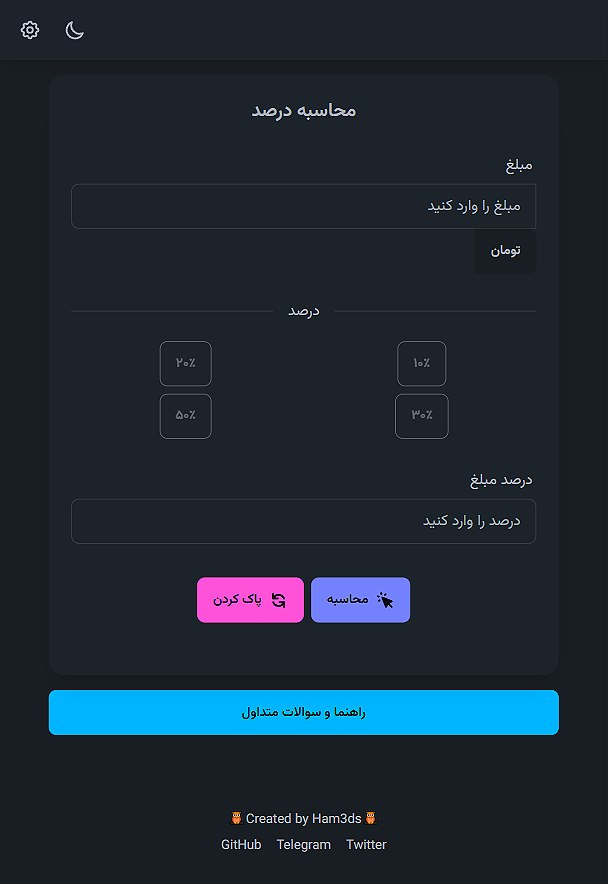

<div dir="rtl">

<div align="center">

# محاسبه درصد | Dar100

<div align="center">
  
[](https://dar100.netlify.app)


[](https://twitter.com/Ham3ds_)

</div>

## 📝 درباره برنامه

<div align="right">
یک ابزار جالب و جذاب برای محاسبه درصد قیمت‌ها.

* درصدی از یک مبلغ را محاسبه کنید
* تخفیف‌ها و مالیات‌ها را محاسبه کنید
* نتایج را به حروف مشاهده کنید
* محاسبات خود را ذخیره کنید
</div>

## 🗂️ ساختار پروژه

<div align="left">
<pre dir="ltr">
Dar100/
├── 📄 index.html
├── 📦 package.json
├── 📦 package-lock.json
├── 🎨 tailwind.config.js
├── 📁 css/
│   └── styles.css
├── 📁 js/
│   └── script.js
├── 📁 src/
│   ├── 📁 components/
│   │   ├── calculator.js
│   │   ├── history.js
│   │   ├── settings.js
│   │   └── themes.js
│   ├── 📁 styles/
│   │   └── main.css
│   └── 📁 utils/
│       ├── formatter.js
│       └── numberToWords.js
└── 📸 1740989525626.jpg
</pre>
</div>

## ⭐ ویژگی‌های کلیدی

<div align="right">

### 🔸 محاسبات پیشرفته
* ✨ محاسبه آنی و دقیق درصد از مبلغ
* 📝 تبدیل خودکار اعداد به حروف فارسی
* 🎯 دقت بالا در محاسبات
* 💾 ذخیره‌سازی هوشمند نتایج

### 🔸 رابط کاربری هوشمند
* 🌓 حالت شب و روز
* ⌨️ کلیدهای میانبر کاربردی
* 📱 طراحی واکنش‌گرا
* ⚡ عملکرد سریع و روان

### 🔸 امکانات پیشرفته
* 📊 تاریخچه محاسبات (۵ مورد آخر)
* 📋 کپی سریع نتایج
* ⚙️ تنظیمات شخصی‌سازی
* 💡 راهنمای جامع کاربری
</div>

## 💻 پیش‌نیازهای نصب

<div align="right">

* Node.js نسخه 14 یا بالاتر
* npm نسخه 6 یا بالاتر

</div>

## 🚀 نصب و راه‌اندازی

</div>

<div dir="ltr">

```bash
# Clone the repository
git clone https://github.com/Ham3ds/dar100.git

# Navigate to project directory
cd dar100

# Install dependencies
npm install

# Start development server
npm run dev
```

</div>

<div dir="rtl">

## ⌨️ کلیدهای میانبر

<div align="left">

| کلید | عملکرد |
|------|---------|
| `Ctrl + Enter` | محاسبه |
| `Esc` | پاک کردن فرم |
| `Alt + 1` | محاسبه ۱۰٪ |
| `Alt + 2` | محاسبه ۲۰٪ |
| `Alt + 3` | محاسبه ۳۰٪ |
| `Alt + 5` | محاسبه ۵۰٪ |

</div>

## 🔧 تنظیمات

<div align="right">
تنظیمات برنامه از طریق آیکون چرخ‌دنده در نوار بالایی قابل دسترسی است:

* 🌓 تغییر حالت نمایش (شب/روز)
* 💾 مدیریت ذخیره‌سازی خودکار
* 🎨 شخصی‌سازی رابط کاربری
</div>

## 🌐 دسترسی آنلاین

<div align="right">
برنامه در آدرس زیر به صورت آنلاین در دسترس است:  
<div dir="ltr">
<div align="center">

[Dar100.app](https://dar100.netlify.app)

</div>
</div>

</div>

<div dir="ltr">

---

# Dar100 - Percentage Calculator

<div align="center">


[](https://twitter.com/Ham3ds_)

</div>

## 📝 About

A powerful and user-friendly percentage calculation tool that enables you to:

- Calculate percentages of amounts instantly
- Apply discounts and taxes
- View results in words
- Manage your calculations efficiently

## 🗂️ Project Structure

```
dar100/
├── 📄 index.html
├── 📦 package.json
├── 📦 package-lock.json
├── 🎨 tailwind.config.js
├── 📁 css/
│   └── styles.css
├── 📁 js/
│   └── script.js
├── 📁 src/
│   ├── 📁 components/
│   │   ├── calculator.js
│   │   ├── history.js
│   │   ├── settings.js
│   │   └── themes.js
│   ├── 📁 styles/
│   │   └── main.css
│   └── 📁 utils/
│       ├── formatter.js
│       └── numberToWords.js
└── 📸 1740989525626.jpg
```

## ⭐ Key Features

### 🔸 Advanced Calculations
- ✨ Instant and accurate percentage calculations
- 📝 Automatic number to Persian words conversion
- 🎯 High precision computations
- 💾 Smart result storage

### 🔸 Smart UI
- 🌓 Dark/Light mode
- ⌨️ Practical keyboard shortcuts
- 📱 Responsive design
- ⚡ Fast and smooth performance

### 🔸 Pro Features
- 📊 Calculation history (last 5)
- 📋 Quick result copying
- ⚙️ Customization settings
- 💡 Comprehensive user guide

## 💻 Prerequisites

- Node.js version 14 or higher
- npm version 6 or higher

## 🚀 Installation & Usage

```bash
# Clone the repository
git clone https://github.com/Ham3ds/dar100.git

# Navigate to project directory
cd dar100

# Install dependencies
npm install

# Start development server
npm run dev
```

## ⌨️ Keyboard Shortcuts

| Key | Action |
|-----|--------|
| `Ctrl + Enter` | Calculate |
| `Esc` | Clear Form |
| `Alt + 1` | Calculate 10% |
| `Alt + 2` | Calculate 20% |
| `Alt + 3` | Calculate 30% |
| `Alt + 5` | Calculate 50% |

## 🔧 Settings
Access application settings via the gear icon in the top bar:
- 🌓 Toggle display mode (Dark/Light)
- 💾 Manage auto-save
- 🔔 Notification settings
- 🎨 UI customization

## 🌐 Online Access

The application is available online at:  
<div align="center">

[Dar100.app](https://dar100.netlify.app)

</div>
